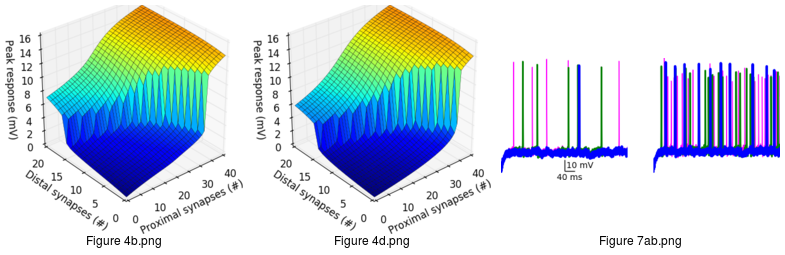

### NEURON simulation source code

Source code from
Behabadi BF, Polsky A, Jadi M, Schiller J, Mel BW Location-dependent excitatory synaptic interactions in pyramidal neuron dendrites.  PLoS Comput Biol. 2012;8(7)
[[pubmed]](https://www.ncbi.nlm.nih.gov/pubmed/22829759)

Adapted from [original ModelDB submission](https://senselab.med.yale.edu/ModelDB/ShowModel.cshtml?model=151404), updated to run inside companion docker image.

The code here reproduces Figures 4b, 4d, and 7ab from the paper.

### Usage

    # create docker image
    cd docker && docker build -t neuron . && cd -

    # run simulations
    time docker run -it -v /full/path/to/bfb-etal-2012:/nrn -w /nrn neuron ./runall.sh
    # This will generate 2 h5 files in data/ and 3 png files in figs/

### Notes 

Figure 7ab traces may not exactly match those in paper due to PRNG issues.
